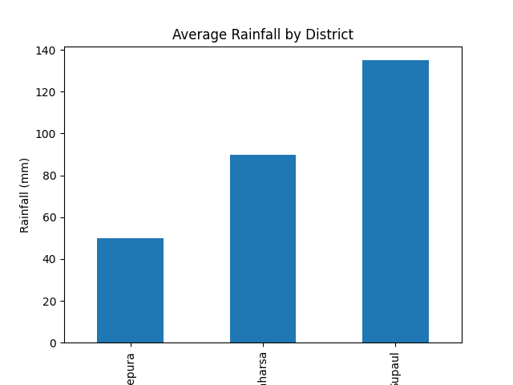
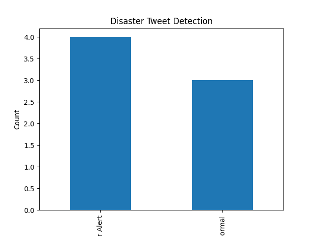
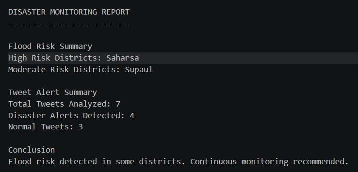
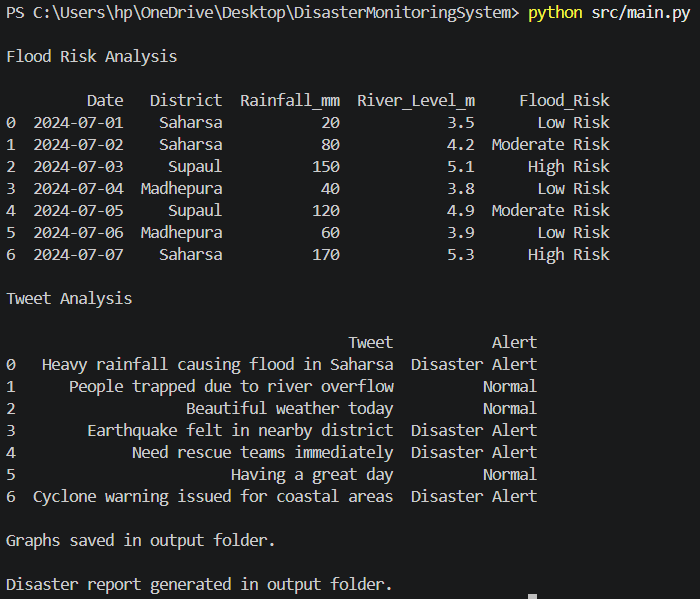

# Disaster Monitoring System (Python)

## Overview
This project is a Python-based disaster monitoring system that analyzes flood risk and detects disaster-related social media alerts.

## Features
- Flood risk detection using rainfall and river level data
- Disaster tweet alert detection
- Data visualization using graphs
- Automatic disaster risk report generation

## Technologies
Python, Pandas, Matplotlib

## Run the Project

Install dependencies:

pip install -r requirements.txt

Run:

python src/main.py

## Output Example

 

                                

                                

                                

